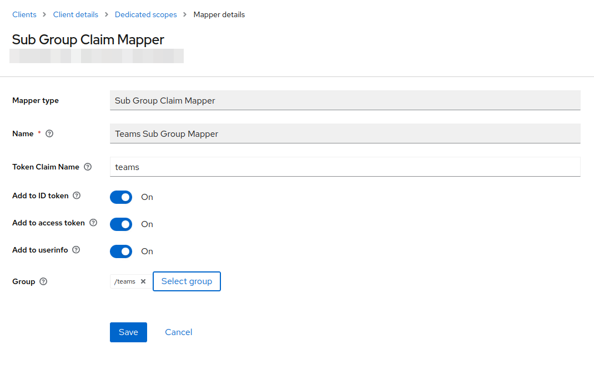

# Keycloak sub-group-claim-mapper Extension

A Keycloak protocol mapper which decodes a parent group as claim and its subgroups as claim values.

## Example

For a Keycloak group and subgroups:

```
teams
  - red
  - blue
  - green

```
and a user which is member of `red` and `green`, and given the following mapper configuration on a client scope:



the following token claim is produced:

```
...
  "teams": [
    "red",
    "green"
  ],
...
```
